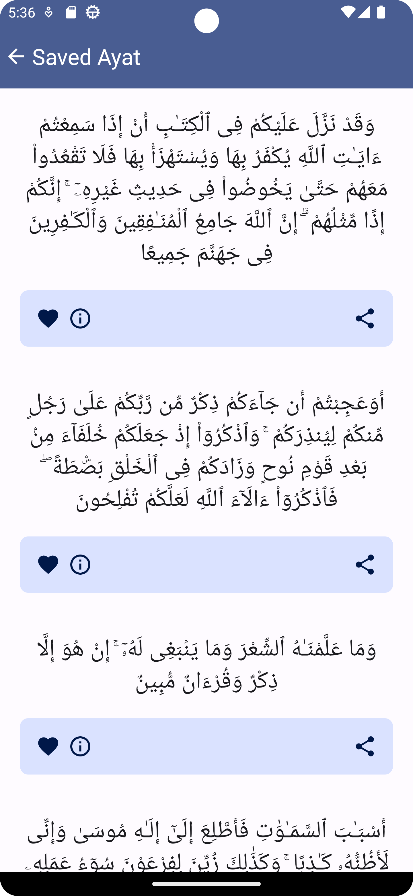
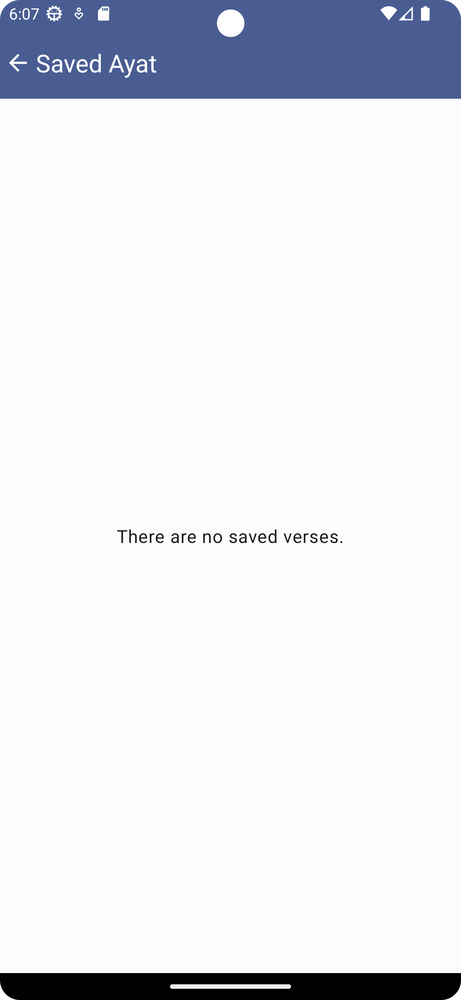
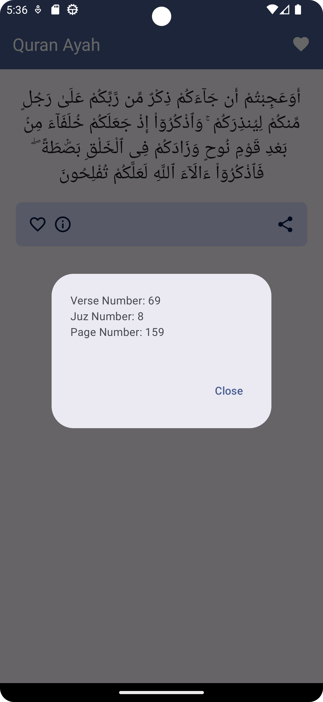
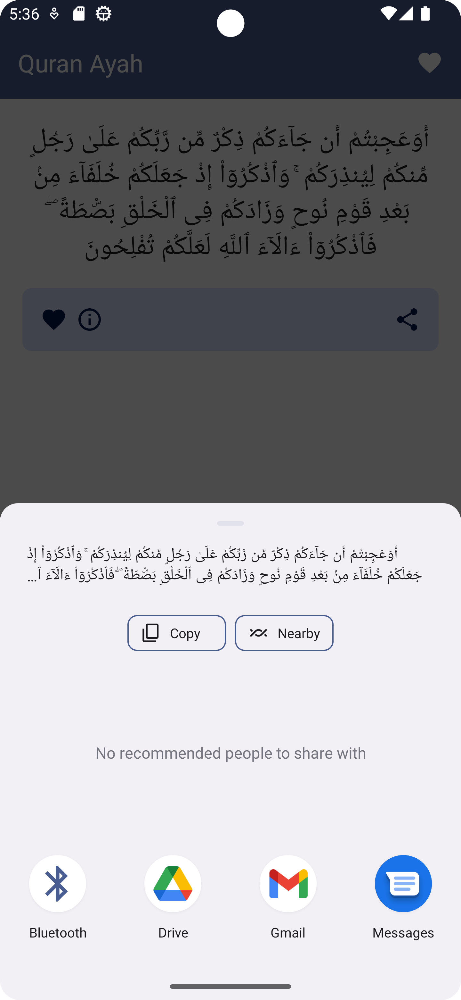

# Quran Ayah

Get a random verse from the Holy Quran each time you open the application, or swipe to refresh the page. You can save, share, and view information related to the verse. The application uses a public API from [Quran.com](https://quran.api-docs.io/v4/verses/random). The home screen displays the verse, refresh the page to get new verses, click save to store it locally in your database, click share to share it on different platforms and info to get more detailes about it. click the toolbar save icon to see all your saved verses, click save icon to remove it.

  
  
  
  
  
  
  

### Built with:
- Jetpack Compose
- Navigation Graph
- Retrofit for Networking
- Hilt for DI
- Kotlin Coroutine + Flow
- MVVM
- Room Database

